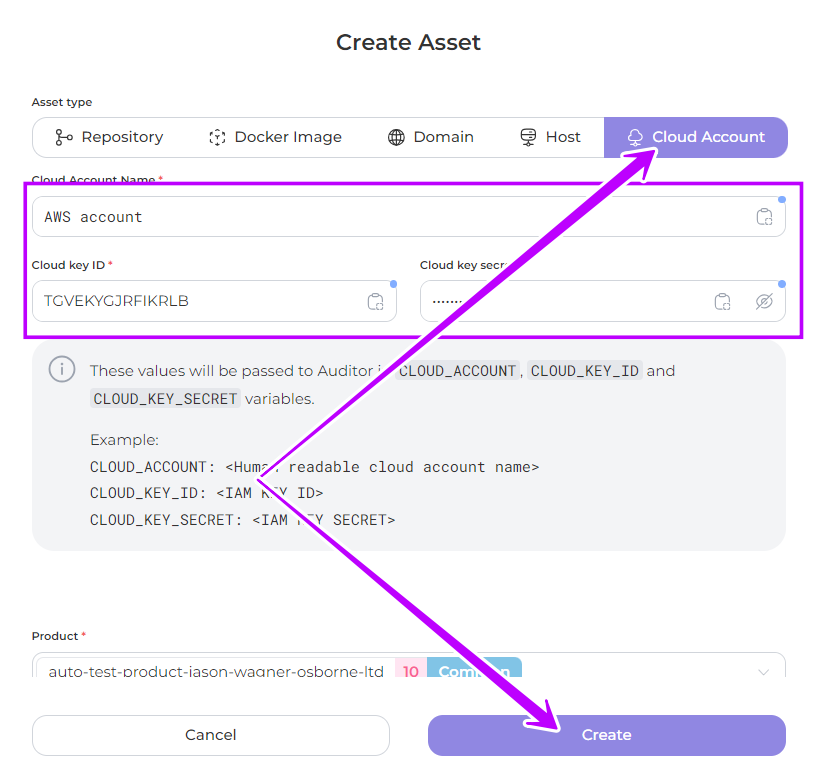

# Product Asset Setting


To ensure the proper functioning of Auditor, include assets for products created in the Portal in version v23.10.1 and earlier.


If the product has already been [created](../../general-portal-settings/product-settings/), add its Asset data. To do this, select the product on the Product page

<figure><figcaption></figcaption></figure>

Specify the location of the product by adding   information about:

* [**Repository**](product-asset-setting.md#repository): to analyse the product <mark style="color:blue;">code</mark> in the repository
* [**Docker image**](product-asset-setting.md#docker-image): to analyse your <mark style="color:blue;">image</mark>
* [**Domain or Host**](product-asset-setting.md#domain-and-host): to analyse your <mark style="color:blue;">web</mark> product
* [**Cloud Account:**](product-asset-setting.md#cloud-account) to analyse the product in a <mark style="color:blue;">cloud account</mark>

<figure><figcaption></figcaption></figure>

## Repository

In the Repository tab, fill in the required fields:

1. **Repository SSH URL**: enter the address of your repository in a specific format, for example: git@gitlab.com:whitespots-public/appsec-portal.git

<figure><figcaption></figcaption></figure>

1. **Repository Link config**: repository source link used to link the portal to your repository based on a created pattern

Select a [pre-created](../../general-portal-settings/repository-link-configs.md) pattern from the drop-down list or use the find a matching config function

<figure><figcaption></figcaption></figure>

Or create a new pattern directly from this section

<figure><figcaption></figcaption></figure>

3. Save the created asset by clicking on the **Create** button

<figure><figcaption></figcaption></figure>

## Docker Image

In the **Repository tab** enter the address of the **registry** where your product is located and click **Create**

<figure><figcaption></figcaption></figure>

## Domain & Host

In the **Domain tab** enter **domain name**, for example whitespots.io

In the **Host tab** enter **host IP**, for example 83.110.124.0

Click **Create**

<figure><figcaption></figcaption></figure>

<figure><figcaption></figcaption></figure>

## Cloud Account

In the **Cloud account tab** enter the **Cloud Account Name** where your product is located,  its **Cloud key ID** and **Cloud key secret** and click **Create**

<figure><figcaption></figcaption></figure>

Apply the created assets when using the[ **Auditor**](../../../auditor/run-audit/)
