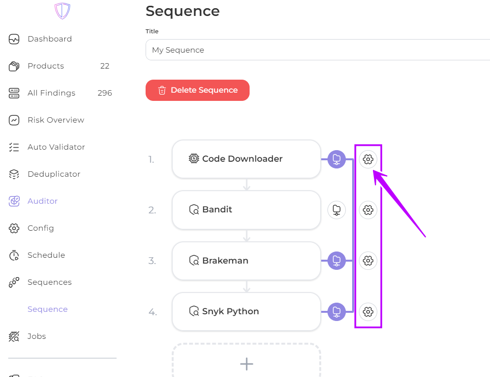
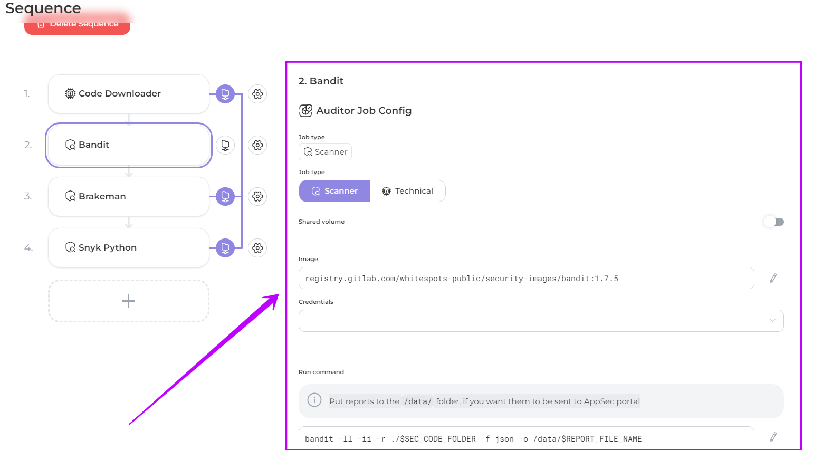

# Sequences setting

You can change or additionally configure either in the created sequencer or during the creation process:

* By clicking on you can _**replace a job**_, _**change**_ its _**setting**_, _**move it**_ (up or down) in your sequence, or _**delete**_ it

<figure><figcaption></figcaption></figure>

<figure><figcaption></figcaption></figure>

* By clicking on a job you can view or change the [**configuration**](../../../../auditor/settings/jobs/job-configuration.md) of the **job** if necessary

<figure><figcaption></figcaption></figure>

* You can **remove** a **sequence** from your list of sequences.

<figure><figcaption></figcaption></figure>
