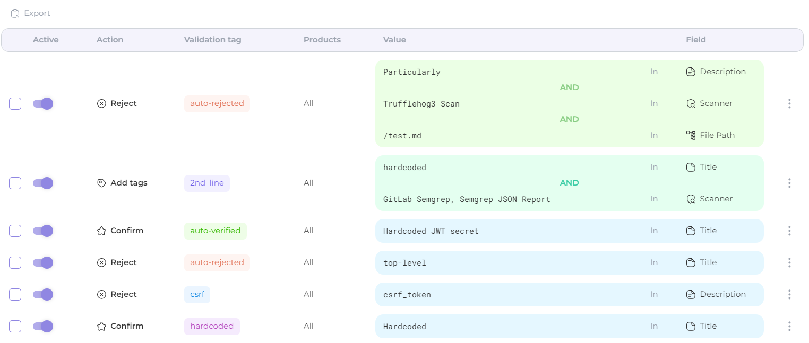
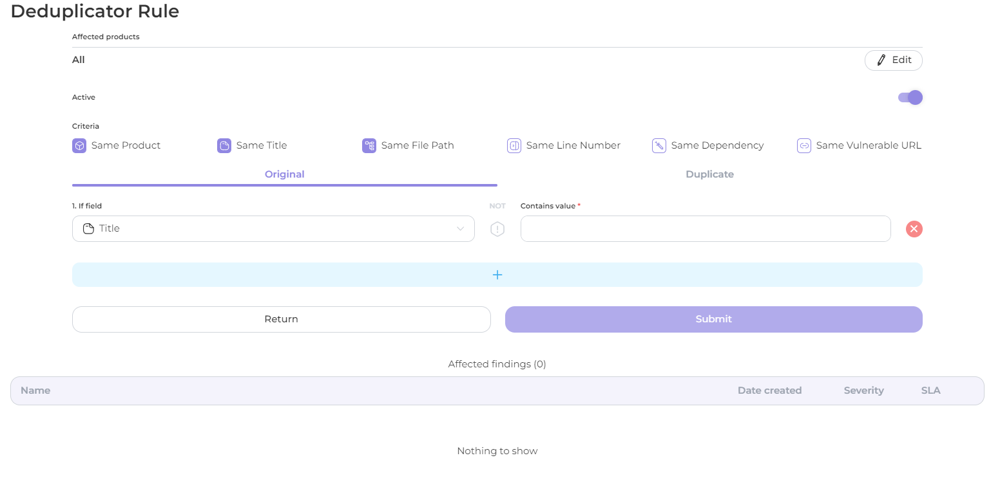
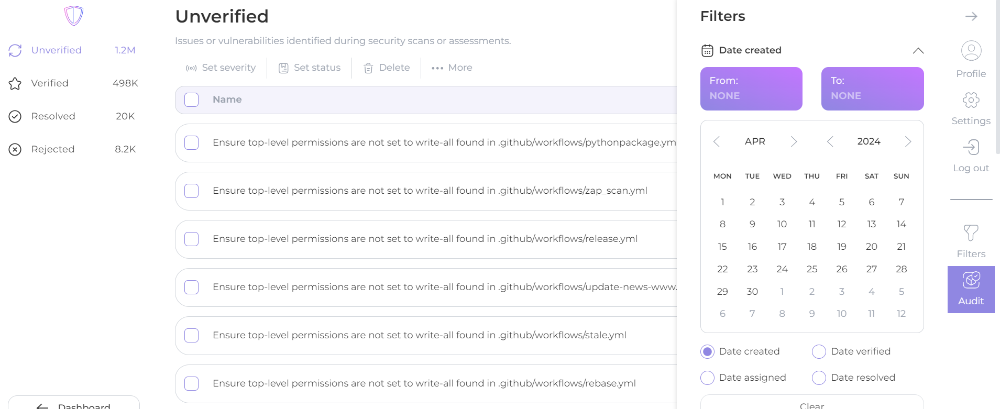
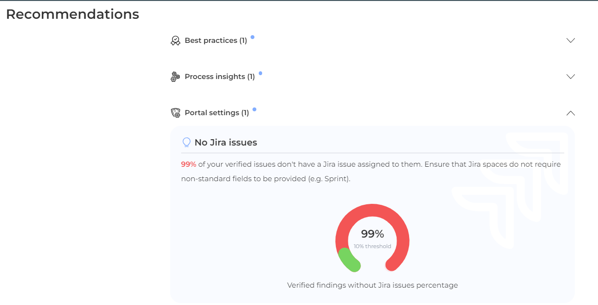

# 🎯 Features

[Import ](scanners/importing-reports-from-scanners-to-appsec-portal/)scanner's report or use [Auditor](../../auditor/) to scan a product with a set of scanners from the AppSec Portal and get a result based on your requirements

<figure><figcaption></figcaption></figure>

#### Security Metrics

[View details](security-metrics/)

✔️ Manage different SLA's and WRT, based on product criticality.

✔️ Customizable dashboard metrics (per products, product types, products with tags and so on) \
✔️ Identify and analyse risk of security defects in every product with informative Dashboard and Risk Assessment Overview.&#x20;

✔️ Configure a CVSS rule to better assess the security of detected issues in your products.

<figure><figcaption></figcaption></figure>

#### Auto Validator

[View details](auto-validator/)

✔️ Helpful tool for automatic validation of findings that does not interfere with the implemented logic.

<figure><figcaption></figcaption></figure>

#### Deduplication Config

[View details](deduplicator/)

✔️ Rules\
✔️ Cross-scanner deduplication \
✔️ Cross-product deduplication (if required)

<figure><figcaption></figcaption></figure>

#### **Findings vi**ew

[View details](findings-view/)

✔️ Groups findings automatic and manual\
✔️ Tag assigning\
✔️ Bulk action\
✔️ Filters and sorting

<figure><figcaption></figcaption></figure>

#### Active tasks

[View details](active-tasks.md)

✔️ A new perspective on active tasks queue: check what's happening in Auto Validator with ease

<figure><figcaption></figcaption></figure>

#### Jira integration

[View details](jira/)

✔️ Portal supports 2 spaces (Security and Product). \
✔️ You can set default space for all products at once. \
✔️ Portal creates tasks in separate query, so other functionality will not affect the speed of task creation.

<figure><figcaption></figcaption></figure>

#### Auditor cooperation

[View details](vulnerability-discovery/auditor-settings/)

✔️ Scans your product directly\
✔️ Using multiple scanners in a single iteration\
✔️ Automatic scheduled scanning of your product

<figure><figcaption></figcaption></figure>

#### **Cust**om Reports

[View details](custom-reports.md)

✔️ Issue a full report or executive summary\
✔️ Include all or verified findings in the report\
✔️ Issue a report for one, multiple or all products\
✔️ View the report online or print it out

<figure><figcaption></figcaption></figure>

#### **R**ecommendations

[View details](recommendations.md)

✔️ Best practice recommendations \
✔️ Recommendations based on process insights \
✔️ Recommendations based on portal settings

