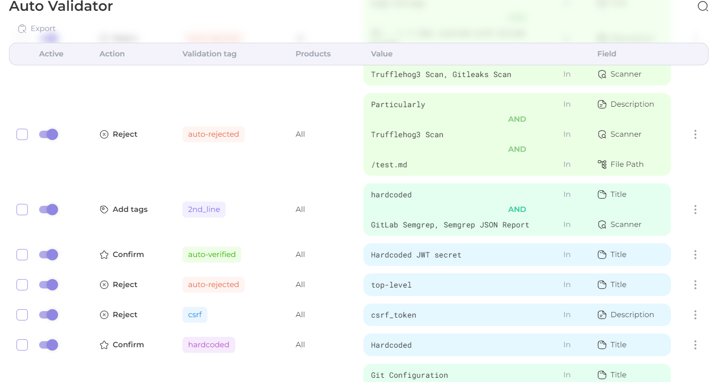

# 🎣 Auto Validator

* [**Rule creation guide**](https://docs.whitespots.io/appsec-portal/features/auto-validator/rule-creation)
* [**Rules filters & sorting**](https://docs.whitespots.io/appsec-portal/features/auto-validator/rules-filters-and-sorting)

**Auto Validator** provides customizable search conditions, automatic triaging, and tag creation for validated findings, making vulnerability management more efficient and seamless.

<figure><figcaption></figcaption></figure>

Average processing speed: **40000 find/sec**.
