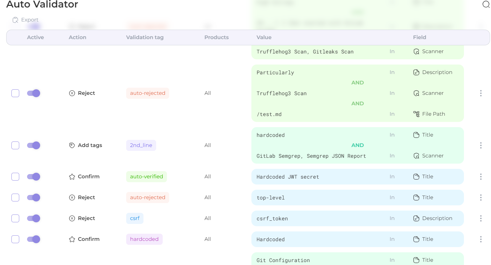

# 🎣 Auto Validator



* [**Rule creation guide**](rule-creation.md)
* [**Rules filters & sorting**](rules-view.md)

**Auto Validator** provides customizable search conditions, automatic triaging, and tag creation for validated findings, making vulnerability management more efficient and seamless.

<figure><figcaption></figcaption></figure>

Average processing speed: **40000 find/sec**.
