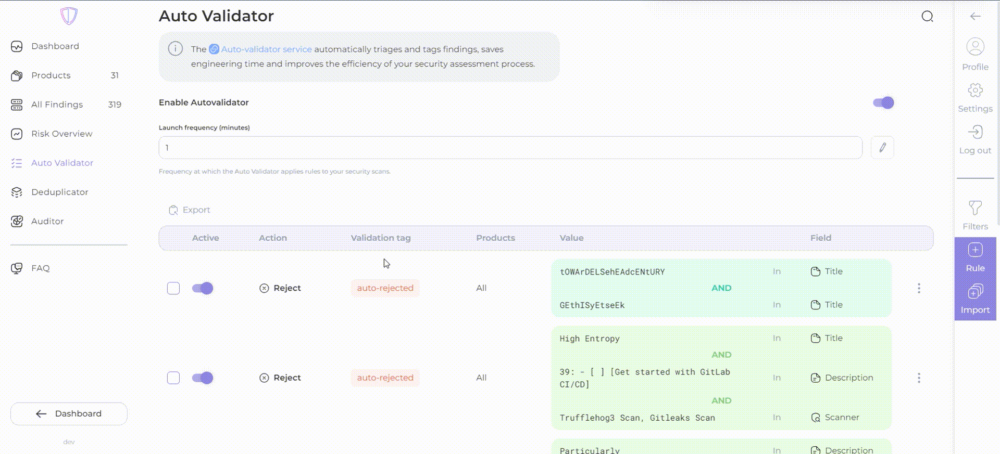

# Rule creation


You can **export** and **import** selected validation rules in JSON format.

To export, select the desired rules and click the **Export** button:

To import, click the '**Import**' button and drag and drop the JSON file containing the validation rules:



1. Add new rule for validation:

<figure><figcaption></figcaption></figure>

* decide what to do with findings if the right conditions are met: **reject, confirm, no, temporarily accept risk or permamently accept risk .** If **сonfirm** is selected, the validator will automatically create corresponding tasks in Jira. If **reject** is selected, findings will be excluded from future checks. If **No** is selected, entered **tag** or/and **group** will be assigned to findings in accordance with rule;
* automatically add tags to validated findings;
* automatically add group to validated findings;
* set conditions: specify the value you want to find or exclude, choose where to search (in the _title_, _description_, _file path, branch,_ _scanner_ name, _dependency_, _vulnerable_ _url_, _import_ _source_ (internal or external at your option);
* you can always combine conditions through **junction**, just click on the plus button.

<figure><figcaption></figcaption></figure>


Get a quick overview of the potential impact of your rule with the _affected findings list_ in the Auto Validator's **rule creation view**.


2. Set the **launch frequency** with which you want the rules to be applied (in minutes):

<figure><figcaption></figcaption></figure>


Note that changing in the execution frequency may require a **service restart** or the **creation of new rules** to apply to existing data.


3\. The validator finishes **before** you even think about making a _coffee_! ☕️

<figure><figcaption></figcaption></figure>


Please note that the Auto Validator feature is limited to one validation rule in the free license. If you wish to use **more than one rule**, you will need to **upgrade to a paid license**.

