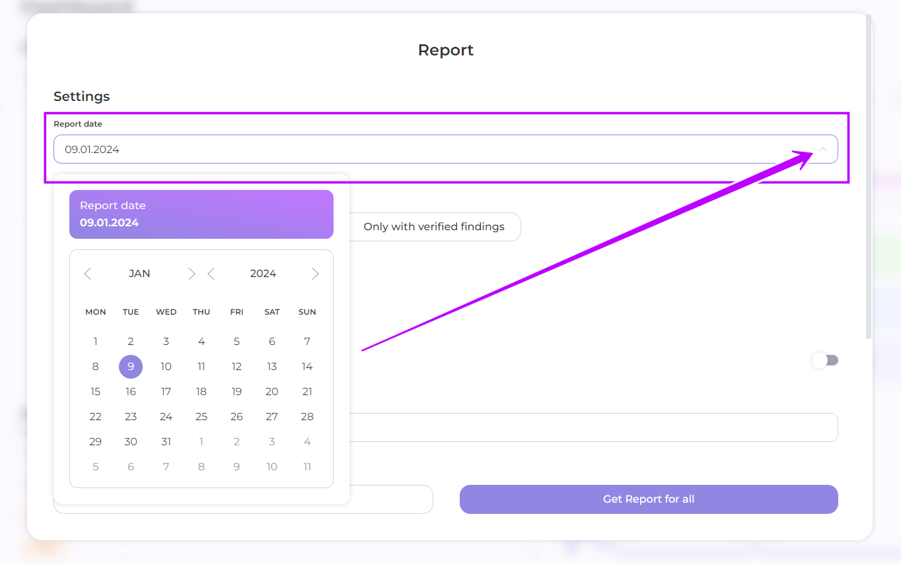
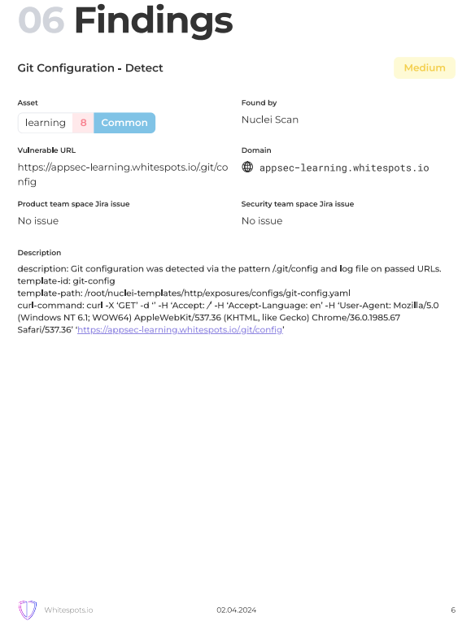
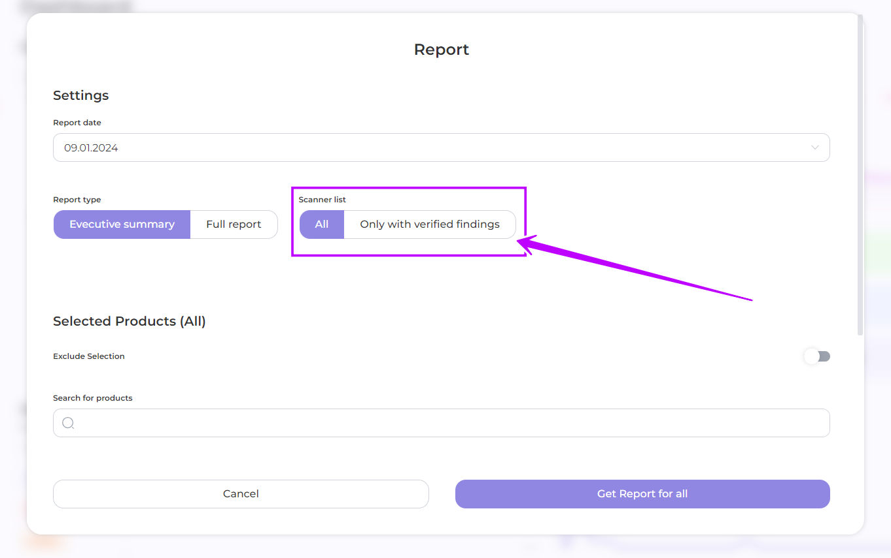
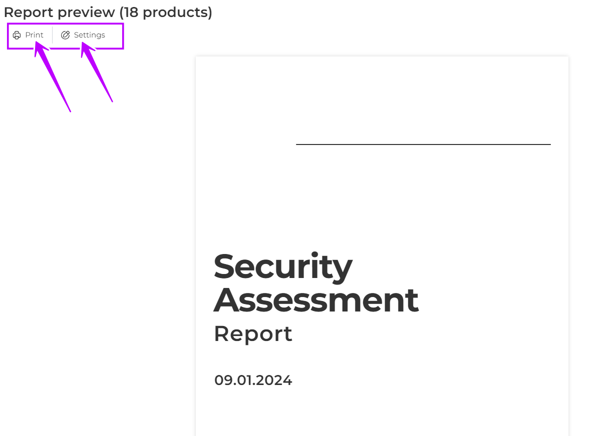

# Custom Reports

From the **Dashboard page** or from the chosen **Product page** click **Report**

<figure><figcaption></figcaption></figure>

<figure><figcaption></figcaption></figure>

Choose the necessary report settings for its output to meet your goals:

1. **Report date**: select the date you want the report to be generated for, or leave it as the default current date

<figure><figcaption></figcaption></figure>

2. **Report type**: select a Executive summary or a Full report detailing each finding\
   In the full report, you can add Jira issue information by turning the slider

<figure><figcaption></figcaption></figure>



<figure><figcaption>
Executive summary and Full report example
</figcaption></figure>



<figure><figcaption>
Executive summary and Full report example
</figcaption></figure>



<figure><figcaption>
Executive summary and Full report example
</figcaption></figure>



<figure><figcaption>
Executive summary and Full report example
</figcaption></figure>



<figure><figcaption>
Executive summary and Full report example
</figcaption></figure>



<figure><figcaption>
Executive summary and Full report example
</figcaption></figure>



<figure><figcaption>
Full Report example
</figcaption></figure>



3. **Scanner list**: select whether to report all or only verified findings

<figure><figcaption></figcaption></figure>

4. **Select products**: Select the products to be included or excluded from the report by clicking on each product, using the search or advanced search options. Alternatively, all products will be included in the report by default.

<figure><figcaption></figcaption></figure>

5. Click **Get Report for selected** and have a report back in a second
6. If necessary, **print** the report or **change the setting** parameters

<figure><figcaption></figcaption></figure>
