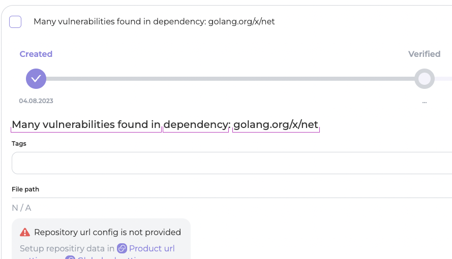
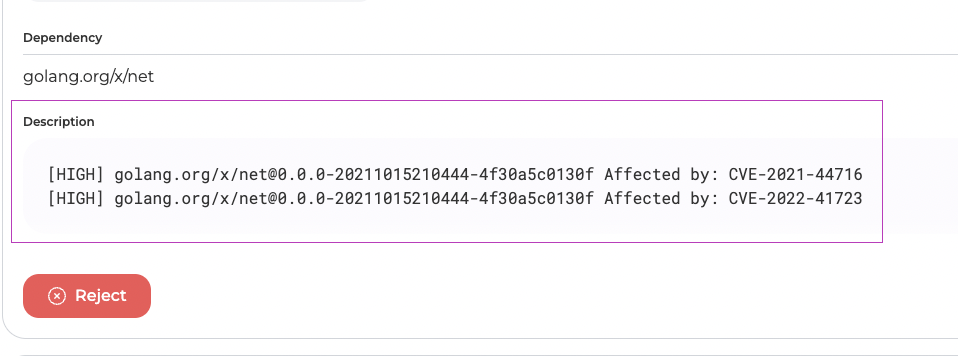
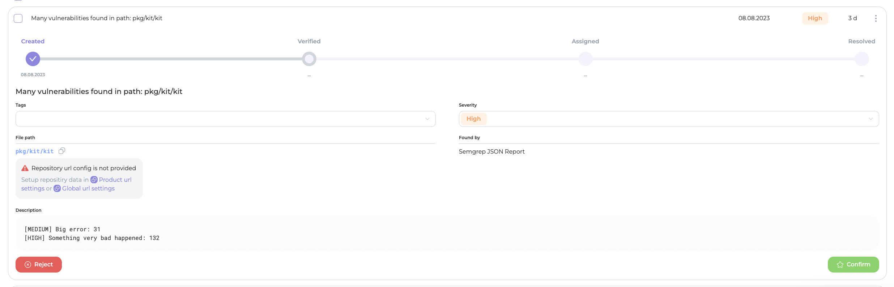

# Grouped findings as a result of

If one of the criteria (**Vulnerable URL**, **Dependency**, **File Path**) is selected in the "Group findings by" field within the [scanner settings](../../general-portal-settings/scanner-settings/), the system checks this field's value during the import of results from the scanner. It then groups all findings with the chosen criterion into a single group.

Grouping operates as follows:

* If a finding lacks a value for the grouping element (_**path**_, _**URL**_, or _**dependency**_), it remains individual.
* If there's only one finding with a specific grouping element value, a new separate finding is created.
* If multiple findings share the same grouping element value, they are grouped into a new grouped finding. Its **name** follows the format:                                                                                                                                  "Many vulnerabilities found in {_grouping\_element\_name_}: {_grouping\_element\_value_}".

<figure><figcaption>
Grouped finding name example
</figcaption></figure>

* The **Description** of the grouped finding includes information about each grouped finding in the format: "\[_severity_] _title_: _line_". The description of a grouped finding is limited to 3000 characters. If the description exceeds this limit, it will be truncated.

<figure><figcaption>
Grouped finding description example
</figcaption></figure>

In grouped findings display, a new field appears (above the Description field), reflecting the grouping element's name (_**URL**_ or _**dependency**_). This field holds the corresponding element's value. If the grouping element is the _**path**_, its value is shown in the "File Path" field.

<figure><figcaption>
Example of a finding with a grouping element <strong>Path</strong>
</figcaption></figure>

<figure><figcaption>
Example of a finding with a grouping element <strong>URL</strong>
</figcaption></figure>

<figure><figcaption>
Example of a finding with a grouping element <strong>Dependency</strong>
</figcaption></figure>

**Setting Severity:** For a grouped finding, the severity is set as the highest severity among the individual findings within it. If a severity value cannot be extracted from a finding, the default scanner severity value is assigned.


If a file reappears during a **reimport** and it had been processed before but _**lacks**_ one of the previously found findings, the grouped finding will _**not be reopened**_. This is because auto closer does not function within grouped findings.&#x20;

If a file contains _**new findings**_ during a **reimport**, they can be added as individual findings or, if there are two or more findings, a new grouped finding can be created.


**Deduplication in the description field:** During vulnerability grouping, the system compiles vulnerabilities that match the selected criterion (Vulnerable URL, Dependency, File Path) into a list. When creating a description for a grouped vulnerability, deduplication occurs. Deduplication involves the system using a set for all descriptions within the group, removing duplicate lines.

Therefore, if you see grouped vulnerabilities where only one vulnerability is visible inside, it means that the descriptions for those vulnerabilities were similar, and deduplication of lines occurred when creating the grouped vulnerability.&#x20;

This mechanism provides a clearer and more compact representation of vulnerability groups, simplifying analysis and enhancing the readability of reports.

<figure><figcaption>
This signifies the existence of multiple vulnerabilities with "Medium" severity and the description "High Entropy" at line 69
</figcaption></figure>
