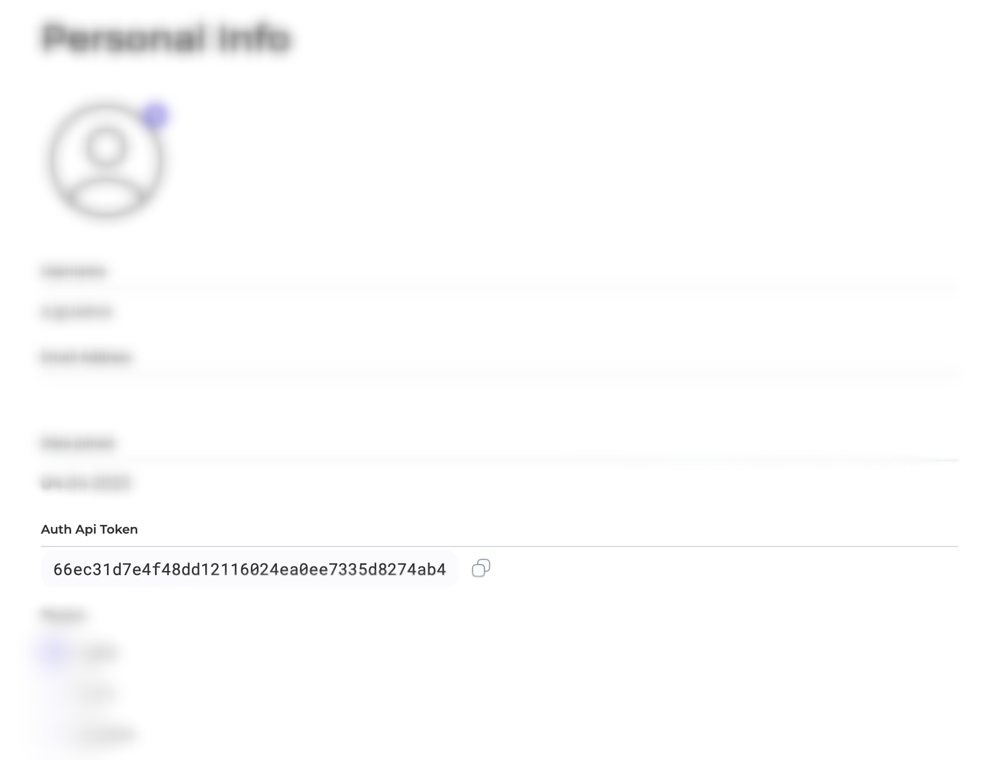

# 🔌 Importing reports from scanners to AppSec Portal

You can import your reports from scanners (in json format) into AppSec Portal for viewing and processing using the following methods:

**Method 1:** [**Mannual import using a Report File**](manual-import-using-report-file.md)

**Method 2:** [**Importing via Terminal using a Report File**](importing-reports-via-terminal-using-a-report-file.md)

**Method 3:** [**Importing via Lambda Function using a Report File**](importing-reports-via-lambda-function-using-a-report-file.md)

### Authorization Token

Before getting started, you will need to obtain an **authorization token**. The token is a unique identifier that is used to authenticate you as a user of AppSec Portal. You can find your token by logging in to the portal and navigating to **Settings->Personal Info** page. Copy the token as it will be used in the `curl` command.

<figure><figcaption>
Authorization token example
</figcaption></figure>
