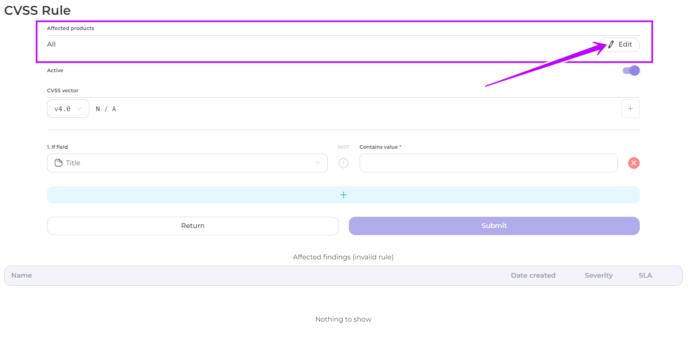
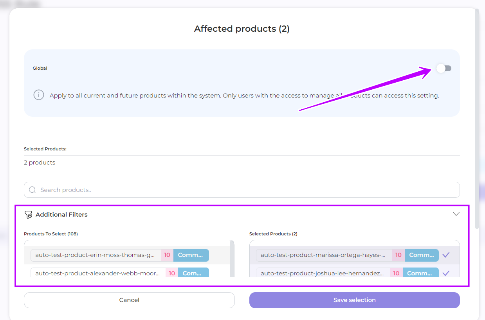
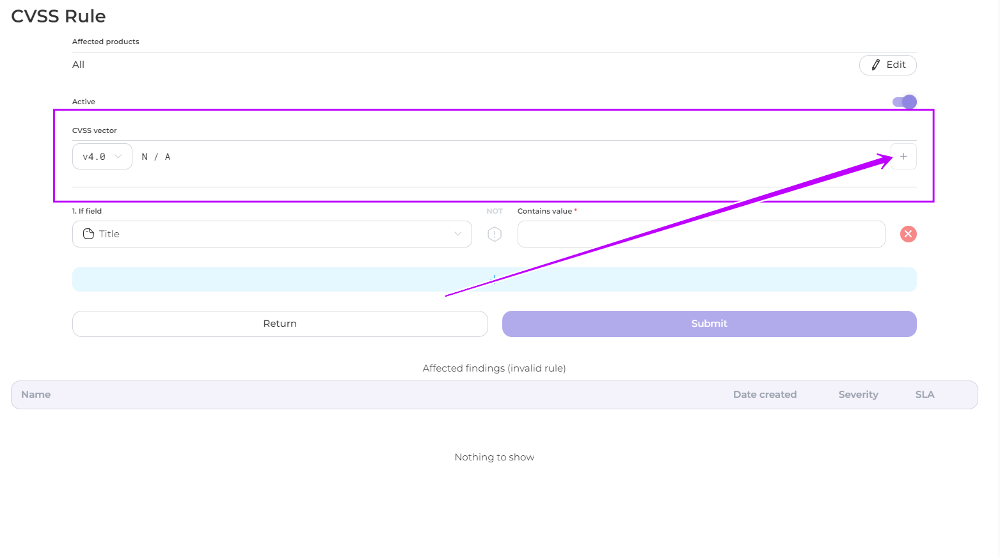
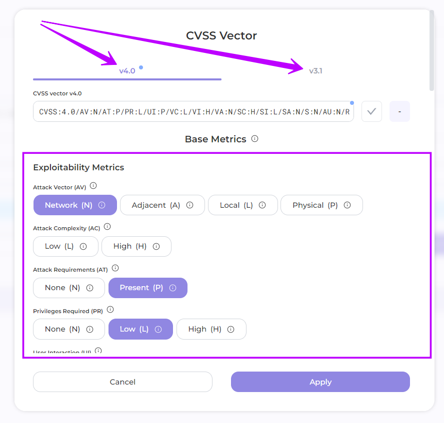
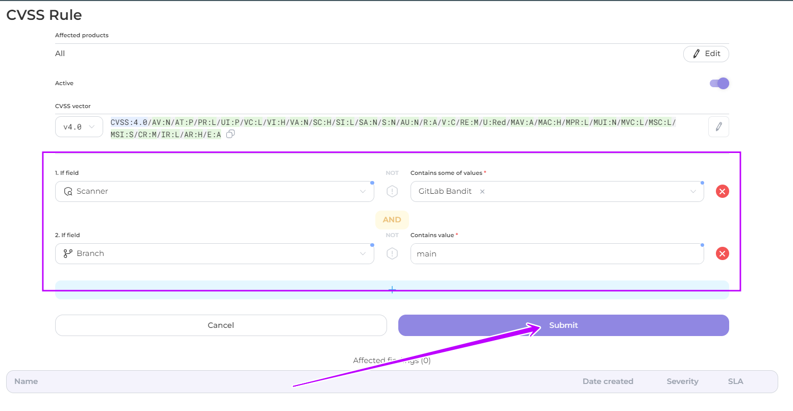
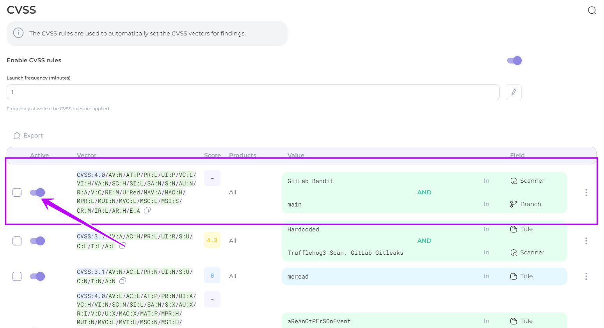

# CVSS Rule

Set up a rule to **automatically** rate your products by following the steps below.

1. Navigate to the CVSS section and click on the **Create Rule** button
2. In the window that opens, select the **products** to which you want the rules to apply, or leave the default setting to include all your products.

<figure><figcaption></figcaption></figure>

<figure><figcaption></figcaption></figure>

<figure><figcaption></figcaption></figure>

3. Add the CVSS vector value

<figure><figcaption></figcaption></figure>

3.1 Select the **version** of the standard and the **values of the metrics** in groups by clicking on the corresponding fields


For more information on the metrics of the [3.1](https://www.first.org/cvss/v3.1/specification-document) and [4.0](https://www.first.org/cvss/v4.0/specification-document) versions of the standard, please refer to the [official documentation](https://www.first.org/cvss/)


<figure><figcaption></figcaption></figure>


In version 3.1, users can **adjust** **all baseline metrics** within the Environmental metrics group to their modified counterparts. This feature allows for the customization of metric values based on a component's specific role within an organization's infrastructure.


4. Select a parameter(s) and enter its value. This rule will be applied to the findings corresponding to these parameters and their values.

Available parameters:

* title
* description&#x20;
* file path&#x20;
* branch
* scanner&#x20;
* dependency&#x20;
* vulnerable url&#x20;
* import source

5. Click Submit

<figure><figcaption></figcaption></figure>

5. The rule will be created and the CVSS value will be automatically assigned to the corresponding findings when processing the scan results.&#x20;

You can disable the application of these rules at any time by toggling the Active slider.

<figure><figcaption></figcaption></figure>

