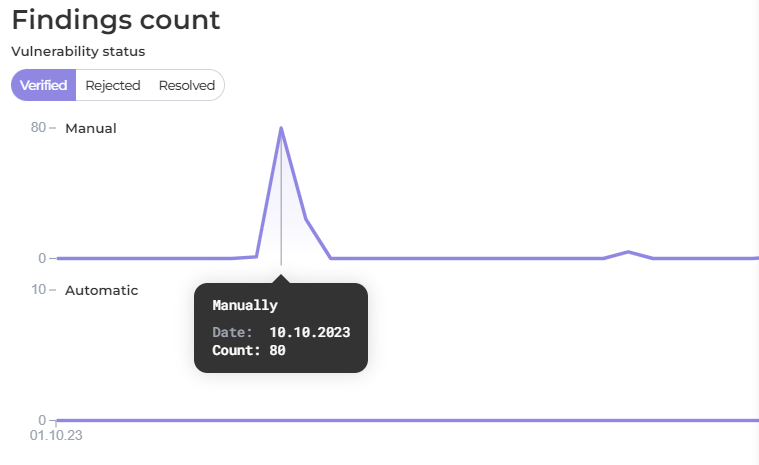

# Severity Statistics Dashboard

* [**General Weighted Risk Trend**](severity-statistics-dashboard.md#general-weighted-risk-trend)
* [**Status change mean time**](severity-statistics-dashboard.md#status-change-mean-time)
* [**Findings count**](severity-statistics-dashboard.md#findings-count)

&#x20;**Severity Statistic view:**

<figure><figcaption></figcaption></figure>

The timeline of the charts can be customized to show data for the last 3 days, last week, last month, or last year, providing flexibility in analyzing different time ranges.&#x20;

### Current Weighted Risk Trend

[**Weighted Risk Trend (WRT)**](wrt-weighted-risk-trend.md) metric empowers organizations to measure and track the state of security in a business-oriented manner. The **General WRT** is calculated by combining the WRT of each product, taking into account their respective severity weights, findings count, and business criticality assessments.

<figure><figcaption></figcaption></figure>


Note that the **General Weighted Risk Trend** displays the [WRT](wrt-weighted-risk-trend.md), risk appetite and severity weight values. Be sure to [set the appropriate weights](https://docs.whitespots.io/appsec-portal/features/security-metrics/metrics-settings) before viewing the graph. Otherwise, the graph may be distorted by incorrect weight values.


By regulary tracking the following global metrics, you can gain a better understanding of your security posture and make informed decisions to enhance your overall security strategy.

### Mean Time of Status Change

By monitoring the **Status change mean time** graph in relation to the [**SLA**](metrics-settings/sla.md) requirements, you can effectively manage and prioritize your remediation efforts, ensuring that critical vulnerabilities are promptly addressed and mitigated according to the established timelines.

* **Average Vulnerability Age** (**AVA**) calculates the average age of vulnerabilities from _creation_ to _remediation_. It helps to determine how long vulnerabilities pose a potential risk.

<figure><figcaption>
AVA graph
</figcaption></figure>

* **Mean Time to Detection** (**MTTD**) measures the average time it takes to _verify_ vulnerabilities from the moment they are _created_. A shorter MTTD indicates an effective and timely vulnerability detection process.

<figure><figcaption>
MTTD graph
</figcaption></figure>

* **Mean Time to Rejection** (**MTR**) measures the average time it takes for a finding to be _rejected_ after _creation_. It provides insights into the speed of handling findings that are determined to be false positives.

<figure><figcaption>
MTR graph
</figcaption></figure>

* **Mean Time to Remediation** (**MTTR**) calculates the average time it takes to _remediate_ vulnerabilities from the moment they are _verified_. A shorter MTTR indicates an efficient vulnerability resolution process.

<figure><figcaption>
MTTR graph
</figcaption></figure>

* **Mean Time to Product Task Assignment** (**MTTAp**) measures the average time it takes for a _validated_ finding to be assigned to a developer (_assignee_) in the Jira product space from the time it is validated. It helps to track the speed at which results are processed after validation and the initiation of the fixing process.

<figure><figcaption>
MTTAp graph
</figcaption></figure>

**Mean Time to Security Task Assignment** (**MTTAs**) measures the average time it takes for a _validated_ finding to be assigned to a developer (_assignee_) in the Jira security space from the time it is validated. It helps to track the speed at which results are processed after validation and the initiation of the fixing process.

<figure><figcaption>
MTTAs graph
</figcaption></figure>

### Findings count

1. **Finding Discovery Rate** (**FDR**) measures the rate at which new vulnerabilities are _verified per day_, either manually or automatically (through the Auto[ Validator](../../auto-validator/)). It helps you evaluate the effectiveness of your Auto Validator's rules and security team.

<figure><figcaption>
FDR chart
</figcaption></figure>

2. **False Positive Rate** (**FPR**) quantifies the rate of reported vulnerabilities that are later determined to be _false positives per day_ manually or by [Auto Validator](../../auto-validator/). A lower false positive rate indicates the accuracy of your vulnerability detection tools and methodologies.

<figure><figcaption>
FPR chart
</figcaption></figure>

3. **Vulnerability Remediation Rate** (**VRR**) tracks the rate at which vulnerabilities are _resolved per day_, either manually or automatically (through the [Auto Closer](../../general-portal-settings/scanner-settings/#auto-closer)). This metric evaluates the efficiency of your vulnerability resolution process.

<figure><figcaption>
VRR chart
</figcaption></figure>
