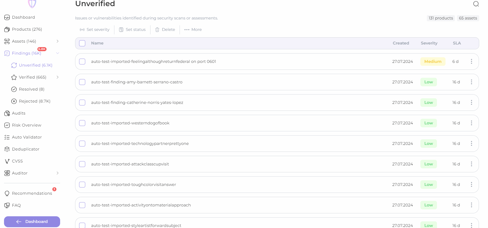

# Available bulk actions

You can set bulk for your findings:

* severity type;
* status setting;
* delete findings;
* add or remove your own custom tags;
* add or remove groups;
* add or remove CWE;
* link issue - link findings to another finding in Jira

<figure><figcaption>
set severity
</figcaption></figure>

<figure><figcaption>
set status
</figcaption></figure>


For temporary risk accepted findings, you can set days accepted.


<figure><figcaption>
delete findings
</figcaption></figure>

<figure><figcaption>
add/remove tag
</figcaption></figure>

<figure><figcaption>
add/remove group
</figcaption></figure>

<figure><figcaption>
add/remove CWE
</figcaption></figure>

<figure><figcaption>
link issue
</figcaption></figure>
