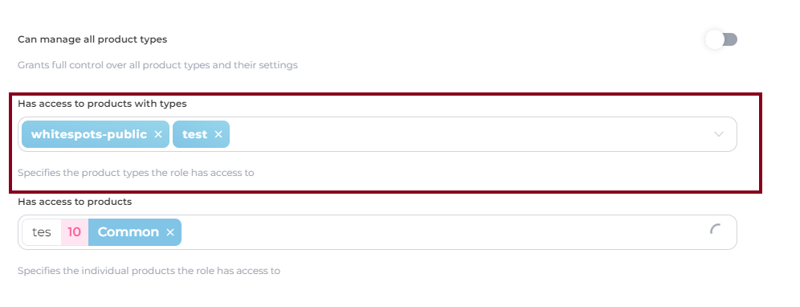

# Creating and editing roles

This page provides guidance on creating and editing roles to customize user access and control in accordance with your organization's requirements.

To create and edit roles, you need to access the "**Roles**" page within the "**Users and Roles**" tab.


User management tasks, such as adding, editing, deleting and assigning roles to users, can only be performed by roles that have been granted the "**Can manage roles and users**" permission. Ensure that the role assigned to your account has this permission in order to access and manage user accounts.


### Contents:

1. [Creating a new role](creating-and-editing-roles.md#creating-a-new-role)
2. [Editing an existing role](creating-and-editing-roles.md#editing-an-existing-role)
3. [Find the role](creating-and-editing-roles.md#find-the-role)
4. [Defining role permissions](creating-and-editing-roles.md#defining-role-permissions)

### Creating a new role

To create a new role with customized access permissions, follow these steps:

1. Access the "**Roles**" page from the "**Users and Roles**" tab.
2. Look for the "**+ Role**" and click on it.
3. Provide a descriptive name for the new role to reflect its purpose or responsibilities.
4. Define the desired access permissions for the role by selecting the appropriate checkboxes [options](creating-and-editing-roles.md#defining-role-permissions).
5. Consider the specific _product types_ or individual _product_ that should be accessible to users assigned to this role.
6. Save the new role by clicking "**Create**" to add it to the list of available roles in the AppSec Portal.

<figure><figcaption>
New role creating
</figcaption></figure>


Please note that the value of "_**Product type**_" takes precedence over the value of "_**Product**_". If any values are selected for the "**Has access to products with types**" section in the role settings, users with that role will see all products with the chosen type, regardless of the values specified in the "**Has access to products**" section



### Editing an existing role

To modify the access permissions or details of an existing role, follow these steps:

1. Access the "**Roles**" page from the "**Users and Roles**" tab.
2. Locate the role you want to edit from the list of available roles.
3. Select the role to view its details and permissions.
4. Make the necessary changes to the role's name or access permissions by selecting or deselecting options.
5. Delete the role if necessarily by pressing "**Delete**" button.

<figure><figcaption>
The role editing
</figcaption></figure>

### Find the role

To find the specific role you're interested in, please use the search function.

<figure><figcaption></figcaption></figure>

### Defining role permissions

When creating or editing a role, it is important to carefully consider the access permissions required for the role. Each permission determines the level of access and control a user with that role will have within the AppSec Portal. Evaluate the specific functionalities and data that should be accessible to users assigned to the role and select the appropriate permissions accordingly.

<table><thead><tr><th width="185">Permission level</th><th width="129">Rule visibility</th><th width="130">Rule editing</th><th>Adding/removing affected products from rules</th></tr></thead><tbody><tr><td><strong>No access</strong> (no available product types/products affecting this rule for the role)</td><td>Rule is hidden</td><td>N/A</td><td>N/A</td></tr><tr><td><strong>Partial access</strong> (at least one product in this rule is available for the role)</td><td>Rule is <mark style="color:green;">viewable</mark></td><td><mark style="color:red;">Restricted</mark></td><td><mark style="color:blue;">Allowed</mark> (only products that are specifically assigned to the role)</td></tr><tr><td><strong>Full access</strong> (all products in a rule are available for the role)</td><td>Rule is <mark style="color:green;">viewable</mark></td><td><mark style="color:green;">Allowed</mark></td><td><mark style="color:green;">Allowed</mark></td></tr></tbody></table>
