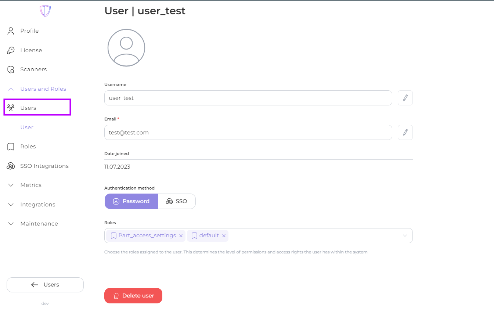
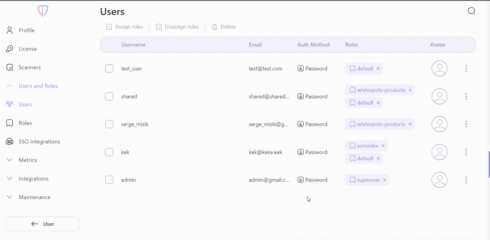

# User management

This page provides an overview of the user management features and guides on performing various user-related tasks.

User management in the AppSec Portal is performed in the "**Users**" page, which can be accessed through the "**Users and Roles**" tab.


User management tasks, such as adding, editing, deleting and assigning roles to users, can only be performed by roles that have been granted the "**Can manage roles and users**" permission. Ensure that the role assigned to your account has this permission in order to access and manage user accounts.


### Contents:

1. [Adding users](user-management.md#adding-users)
2. [Editing user details](user-management.md#editing-user-details)
3. [Assigning roles](user-management.md#assigning-roles)

## Adding users

To add a user, follow these steps:

1. In the "**Users and Roles**" tab, navigate to the "**Users**" section.
2. Click on the "**+ User**" to initiate the user creation process.
3. Provide the **required** user details (marked by red asterisk), such as _username_, _email address_ and _password_.
4. Assign appropriate roles to the user to define their access permissions within the system.
5. Save the user information by clicking on the "**Create**" button.
6. Communicate the login credentials to the user securely, ensuring they have the necessary information to access the AppSec Portal.

<figure><figcaption>
New user creation
</figcaption></figure>

## Editing user details

To edit user details, follow these steps:

1. In the **"Settings"** in the "**Users and Roles**" tab, navigate to the "**Users**" section.
2. Locate the user in the user list.
3. Select the user's profile to access their account details.
4. Update the relevant user information, such as username, email address, authentication method or assign any roles from existing ones.
5. Save the changes by clicking the check mark next to the user value field.

<figure><figcaption>
User details editing
</figcaption></figure>

## Assigning roles

Roles define the access permissions granted to users within the Portal.

1. In the "**Users and Roles**" tab, navigate to the "**Users**" section.

#### Individual assignment

1. Open the user's profile to view their account details.
2. Select the appropriate roles to assign to the user based on their responsibilities and access requirements.
3. Save the changes to update the user's role assignments.

<figure><figcaption>
Individual role assignment
</figcaption></figure>

**Bulk** **assignment**

1. From the user list, select the users to whom you want to assign roles. You can select multiple users at once for bulk assignment (and **bulk unassign**).
2. Click on the "**Assign roles**" or "**Unassign roles**" to manage role assignments.
3. Select the appropriate roles to assign to the selected users based on their responsibilities and access requirements.
4. Save changes by clicking **"Assign"** or **"Unassign"**.

<figure><figcaption>
Bulk role assignment
</figcaption></figure>
