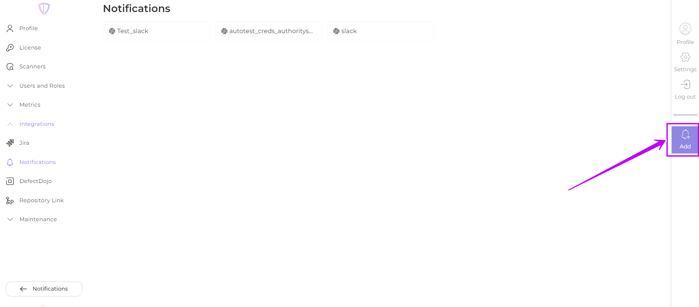
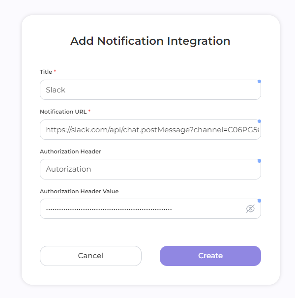

# Integration

To set up integration with your notification service, follow these steps:

1. Navigate to **Settings** -> **Integrations** -> **Notifications**:

<figure><figcaption></figcaption></figure>

2. Click  to create a new integration

<figure><figcaption></figcaption></figure>

3. Fill in the required fields:

* **Title** (<mark style="color:red;">required</mark>): The desired name of the integration or service to which the notification is associated.
* **Notification URL** (<mark style="color:red;">required</mark>): URL to which HTTP requests containing notifications are sent. AppSec Portal will use this URL to deliver notifications.
* **Authorization Header** (<mark style="color:orange;">if your service requires authentication</mark>): The name of the HTTP request header in which the authentication token will be placed.
* **Authorization Header Value** (<mark style="color:orange;">if your service requires authentication</mark>): The authentication token, which is placed in the specified header.&#x20;

<figure><figcaption></figcaption></figure>

4. Click **Create**

<mark style="background-color:blue;">Once the integration is set up, you can</mark> [<mark style="background-color:blue;">configure the notification criteria and frequency</mark>](criteria-and-schedule.md)<mark style="background-color:blue;">.</mark>
