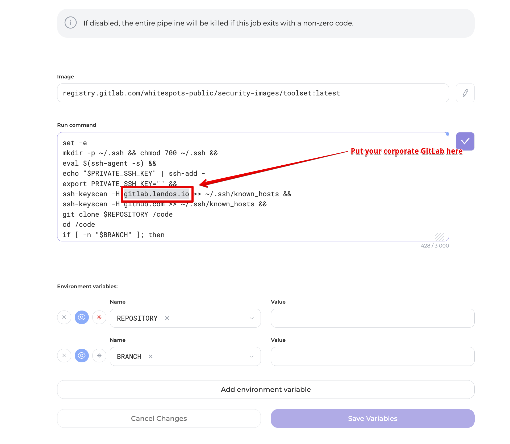

# Status change notification

You can configure notifications for product status changes by going to **Settings** -> **Integrations** -> **Notifications** -> <**Your notification app**> -> **Status Change Notification**

<figure><figcaption></figcaption></figure>

Adjust the settings according to your needs

<figure><figcaption></figcaption></figure>

1. **Status**: Set initial and modifiable status to receive notification of findings

<figure><figcaption></figcaption></figure>

2. **Method of status change**: automatically, manual, any

<figure><figcaption></figcaption></figure>

3. **Number of finds**: Set the number of finds that will trigger a status change notification.

<figure><figcaption></figcaption></figure>

4. Click **Create**
