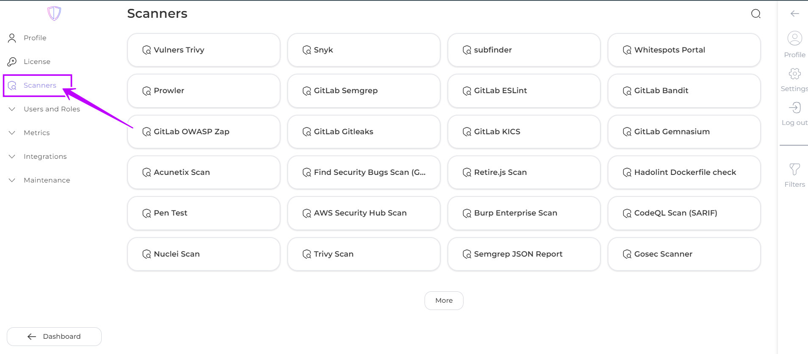
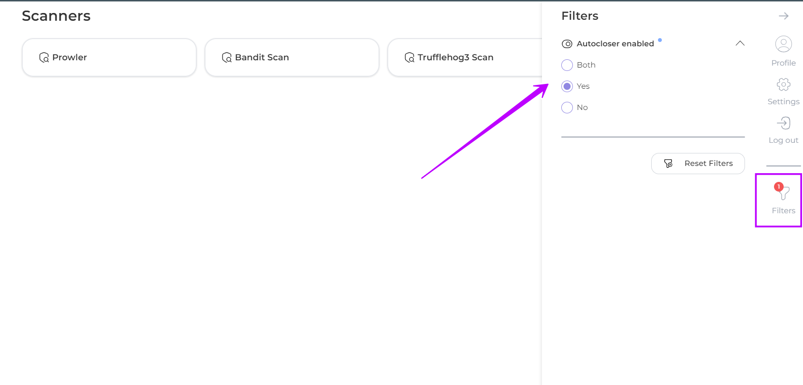
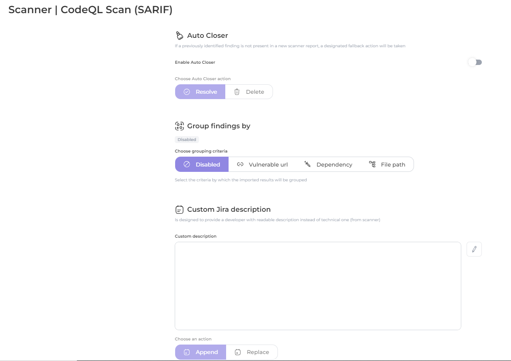
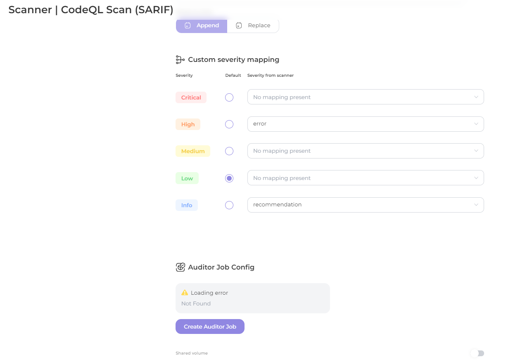
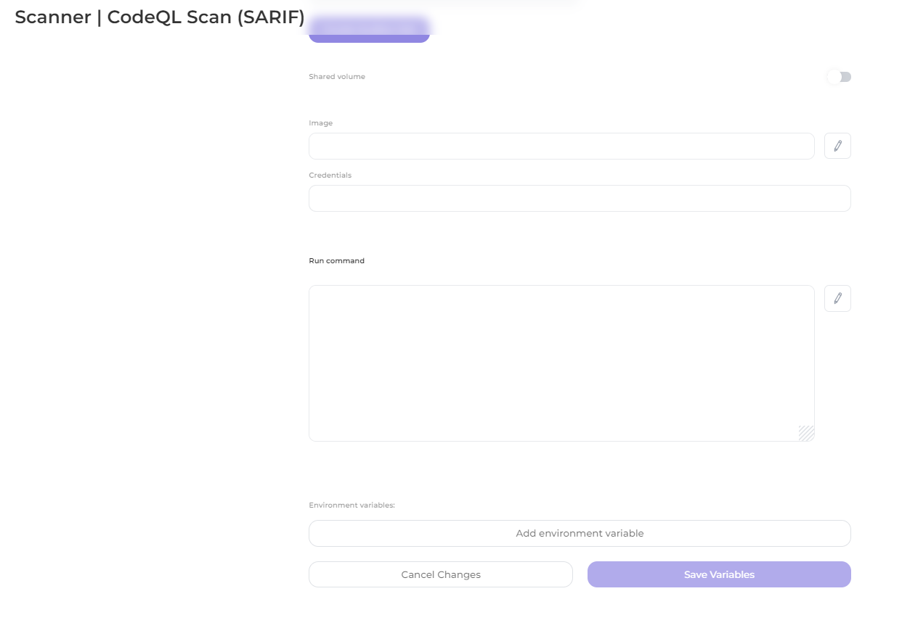

# Scanner settings

* [**Auto Closer**](auto-closer.md)
* [**Group findings by**](group-findings-by.md)
* [**Custom Jira description**](custom-jira-description.md)
* [**Custom severity mapping**](custom-severity-mapping.md)
* [**Auditor Job Config**](auditor-job-config.md)

### Scanners page

To access the list of supported scanners, navigate to **Settings->Scanners**.

<figure><figcaption></figcaption></figure>

The list can be filtered with the "**Auto Closer enabled**" parameter.

<figure><figcaption></figcaption></figure>

To access the settings for a specific scanner, simply click on the scanner card. This will open the settings page for the scanner.

<figure><figcaption></figcaption></figure>

<figure><figcaption></figcaption></figure>

<figure><figcaption></figcaption></figure>
