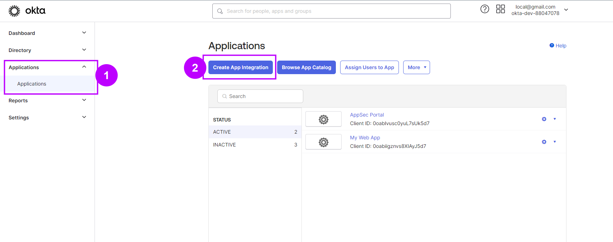
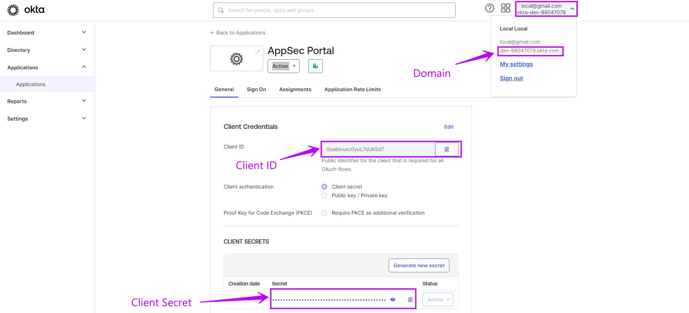

# Okta SSO


The following steps describe the state of Okta at the time of creating this instruction. The Okta interface may change, so for the most up-to-date information, refer to the official [source](https://help.okta.com/en-us/content/topics/apps/apps\_app\_integration\_wizard\_oidc.htm)


To log in to the AppSec portal through your Okta provider, follow these steps:

1. In the Okta admin panel, navigate to the "**Applications**" tab.
2. Click "**Create App integration**"

<figure><figcaption></figcaption></figure>

3. In Sign-in method select **OIDC - OpenID Connect** option
4. In Application type choose **Web Application**
5. Click **Next**
6. Fill in the fields:&#x20;

* **App integration name** - Enter the name of the application as desired
* **Grant type** - Chose Authorization Code
* **Sign-in redirect URIs** - Enter _**https://portal-dev.whitespots.io/oauth2/callback**_&#x20;
* **Sign-out redirect URIs** - Should be left unfilled
* **Controlled access** - Select an option for your users that matches your policy or business process (e.g., "Allow everyone in your organization to access," "Limit access to selected groups," or "Skip group assignment for now")
* Click "**Save** "

<figure><figcaption></figcaption></figure>

Use the data created for your application to [configure ](./)SSO integration in the AppSec portal:

* **Domain**: See user info
* **Client ID**: \<Client ID>
* **Client Secret**: \<CLIENT SECRETS (Secret)>

<figure><figcaption></figcaption></figure>

These settings will allow you to use your Okta provider to log in to the AppSec portal
