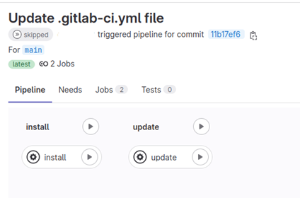

# Update

* [**GitLab CI update**](update.md#option-1.-update-using-gitlab-ci)
* [**Update using Helm**](update.md#update-using-helm)
* [**Manual update**](update.md#option-2.-manual-update)


To update the AppSec Portal to the latest version, follow these steps:

### Update using GitLab CI

1. [Update](https://docs.gitlab.com/ee/user/project/repository/mirror/index.html) your forked repository
2. Run pipeline
3. Click on **update** section

<figure><figcaption></figcaption></figure>

### Update using helm <a href="#update-using-helm" id="update-using-helm"></a>

1. To update, run the following command:

```
helm upgrade appsecportal  <path-to-helm-directory>
```

replace _\<path-to-helm-directory>_ with the path to the directory that contains the Helm Chart for your application.&#x20;

### **Manual update**

1. Stop the application:

```
docker-compose down -v
```

This will stop all services and remove the associated volumes, which will clean up the environment.

2. Pull the latest changes from the repository:

```bash
git pull
```

This ensures that you have the most up-to-date codebase to work with

3. Restart the application:

```
docker-compose up -d
```

