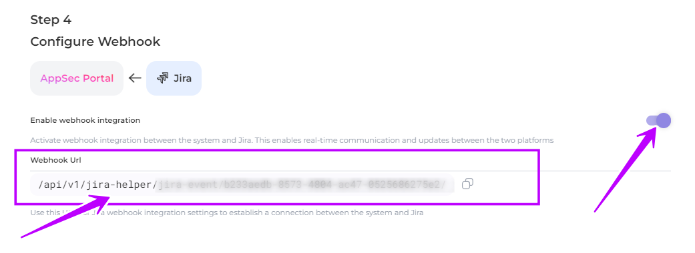
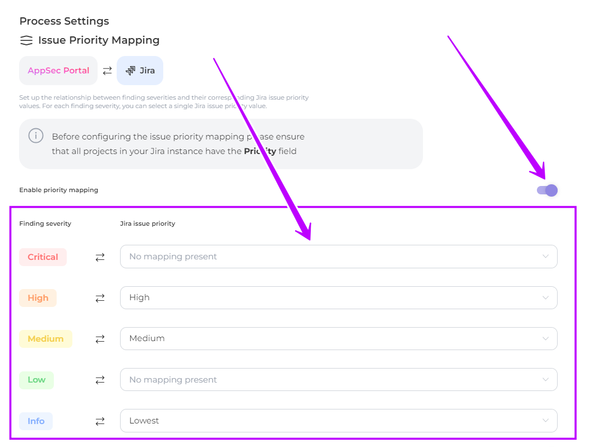

# Jira integration configuration

Follow this guide to configure AppSec Portal integration with Jira and define synchronization parameters for the **Product Team Space** or **Security Team Space**.\
This guide will also allow you to establish **mappings** for **issue status** and i**ssue priority** using the values you have specified in Jira, selecting them from dropdown lists.

* Log in to your AppSec Portal instance
* Navigate to the Settings->Integrations->Jira

<figure><figcaption></figcaption></figure>

## Step 1. Authorization

Choose your preferred authorization method: **Basic** or **OAuth**

Enter the appropriate credentials for the chosen method:

* For **Вasic** authorization, enter your **Jira server URL**, **e-mail** and _**Auth token:**_


&#x20;If you don't already have a Jira API token, you'll need to create one in Jira. You can do this by logging in to Jira and navigating to the '**API tokens**' page in your profile settings ([**Atlassian account settings->Create and manage API tokens->Security**](https://id.atlassian.com/manage-profile/security/api-tokens)). From there, you can create a new API token and use it to authenticate with AppSec Portal using basic authorization.


<figure><figcaption></figcaption></figure>

<figure><figcaption></figcaption></figure>

* For **OAuth**, enter your Jira server URL, access token secret, access token secret, consumer key, and certificate file. To use Jira OAuth, you need to create an _application link_ between Jira and AppSec Portal. You can find detailed instructions on how to create an application link [here](https://developer.atlassian.com/server/jira/platform/oauth/).

<figure><figcaption></figcaption></figure>

## Step 2. Issue Status Mapping

Configure the mapping between finding statuses and Jira issue statuses. \
Select from dropdown list one or more issue statuses to be automatically set in Jira when findings statuses change.

<figure><figcaption></figcaption></figure>

## Step 3. Default Team Spaces

Set default security space and default product space to save time from configuring them in product settings. This **configuration is global** and will be automatically assigned to all newly created products. You may set _**specific**_ product and security space in [product setting](../general-portal-settings/product-settings/) if it's necessary.

* Choose **Product Team Space** or **Security Team Space** for status and priority mapping and toggle the switch accordingly
* **Team space** ("Product team space" or "Security team space"): Enter space name for product and/or security team
* **Issue type for** the corresponding space: Select from dropdown list
* **Issue status for** **resolved** findings: Select from dropdown list
* **Issue status for rejected** findings: Select from dropdown list
* **components**: Select from dropdown list
* **push due date**: Select from dropdown list

<figure><figcaption></figcaption></figure>

## Step 4. Webhook integration

**Enable webhook integration**: Activate real-time communication and updates between AppSec portal and Jira by toggling the switch\
**Webhook Url**: Use this the Webhook URL for establishing a connection between the systems

<figure><figcaption></figcaption></figure>


Please note that for a successful integration with Jira, you must ensure that the web address specified in the 'Webhook Url' field ends with a slash ('**/**'). Otherwise, the integration may not work correctly.


## Step 5. Issue Priority Mapping

Optionally, establish a mapping between finding severity and Jira issue priority.\


Ensure all projects **in your Jira** instance have the "Priority" field before configuring. In case of any modifications to the priority descriptions in Jira **after** configuring the **mapping**, the AppSec Portal will **not update** them.


* Activate **Enable priority mapping** by toggling the switch
* Configure the mapping between **Finding severity** and **Jira issue priority** from the dropdown lists

<figure><figcaption></figcaption></figure>

## Step 6. Close Security Issue if corresponding Product Issue is done

Choose this option to automatically transition Security Team Issues to a selected resolution status when the corresponding Product Team Issue is marked as resolved in Jira.

<figure><figcaption></figcaption></figure>

## Step 7. Delete issues for rejected findings

Activate this option to delete issues associated with rejected findings in Jira.

<figure><figcaption></figcaption></figure>


If you choose to dismiss a finding in Jira ("False Positive"), the portal may send a request to delete the corresponding task in Jira, given the deletion option is enabled. Please exercise caution and be aware that dismissing findings can lead to task removal in the connected Jira system


_**Congratulations**_! You can now create and update tasks in AppSec Portal, and they will be automatically reflected in your Jira instance. :tada:
