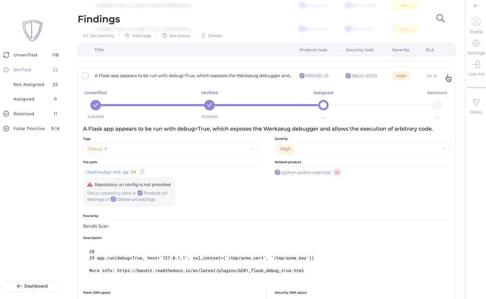

# Setting up Jira webhook

### Step 1: Create a new webhook in Jira

1. Log in to your Jira instance.
2. Navigate to the space you want to integrate with AppSec Portal.
3. Click on the "**Settings**" icon on the right side of the header.
4. Select "**System**" from the dropdown menu.
5. Select the "**WebHooks**" from the menu on the left side of the screen.
6. Click on the "**Create a WebHook**" button.

<figure><figcaption>
"Create a WebHook" page
</figcaption></figure>

### Step 2: Configure the webhook in Jira

1. Enter a name for the webhook in the "**Name**" field.
2. Enter the [webhook URL](setting-up-jira-webhook.md#understanding-the-webhook-url) provided by AppSec Portal in the "**URL**" field.

The webhook URL provided is an endpoint within the AppSec Portal's API that Jira can use to send events or data.


In the example below, the **URL** has several components separated by forward slashes:

* `https://<appsec-portal-host>/api/v1/jira-helper/jira-event`: This is the route for the webhook that receives the Jira event.
* `e2b7e8be-1c77-4969-9105-58e91bd311cc`: This is a _unique identifier_ (token) that is associated with the specific webhook event. This identifier is used to ensure that the event is coming from a trusted source and to match the incoming event with the corresponding webhook configuration.


<figure><figcaption></figcaption></figure>

3. Select the "**Issue related events**" that will trigger the webhook:&#x20;

* check the "_updated_" and "_deleted_" boxes in the "**Issue**" and "**Comment**" columns.

4. Select the scope: **all issues.**
5. Leave the "Exclude body" option unchecked.
6. Save your changes.



<figure><figcaption></figcaption></figure>



<figure><figcaption></figcaption></figure>



### Step 3: Test the webhook

Now you can test the webhook by **adding a label** or **changing the status** of a task in Jira and see if the corresponding updates are reflected in the AppSec Portal.

<figure><figcaption></figcaption></figure>
