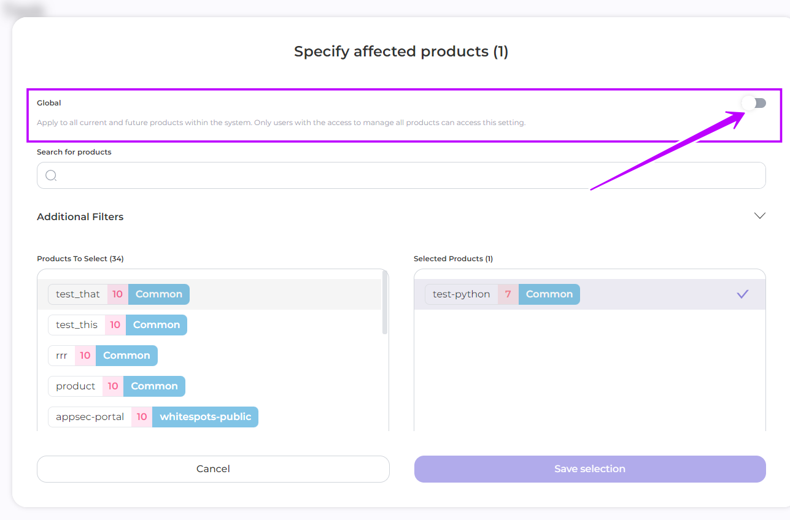

# Scheduled Audit Run

1. From the Dashboard page navigate to Aditor -> Schedule

<figure><figcaption></figcaption></figure>

2. Click on the **Task** in the right panel.

<figure><figcaption></figcaption></figure>

3. In the opened window, complete the following fields: **Title**, **Crontab**, **Job Sequence**, **Affected products**.\
   You can deactivate the schedule any time by toggling the **Active** slider.

<figure><figcaption></figcaption></figure>

3.1 In the **Title** field enter the name of your schedule, e.g.:

<figure><figcaption></figcaption></figure>

3.2 Click the _**Set Schedule**_ button in the **Crontab** field to customize the Auditor's run time.

<figure><figcaption></figcaption></figure>

In the displayed calendar, set the Auditor's work:

* Periodicity: Monthly, Weekly or Daily
* The Date of the month or Day of the week for monthly and weekly frequency, respectively
* Time

Days and Times support multi-selection&#x20;

Click **Apply** to accept the configuration



<figure><figcaption></figcaption></figure>



<figure><figcaption></figcaption></figure>



<figure><figcaption></figcaption></figure>



The selected time will be displayed in the field in the format \*\*\*\*\*, where&#x20;

<figure><figcaption>
Your schedule is set up for audits every Monday and Thursday at 8:00 a.m. and 3:00 p.m.
</figcaption></figure>

3.3 For **Job Sequence**, choose from the drop-down list.

<figure><figcaption></figcaption></figure>

3.4 **Affect products**:&#x20;

* All your products are automatically added to the schedule. You can also select product tags and all products with the selected tags will be included in the auditor's processing.

<figure><figcaption></figcaption></figure>

* Or select **specific products** by clicking **Edit** and choosing particular products.

<figure><figcaption></figcaption></figure>

4. Click **Create**

<figure><figcaption></figcaption></figure>


The audit is run on all the assets that are set up in the selected products


If necessary, you can change the settings in the created task. \
You can also include all current and future products in the schedule.

<figure><figcaption></figcaption></figure>

If global settings are selected in your schedule, you can specify a tag name so that the auditor only scans products with that tag.


This setting can only be made by users with a role that has access to all product types.


<figure><figcaption></figcaption></figure>
