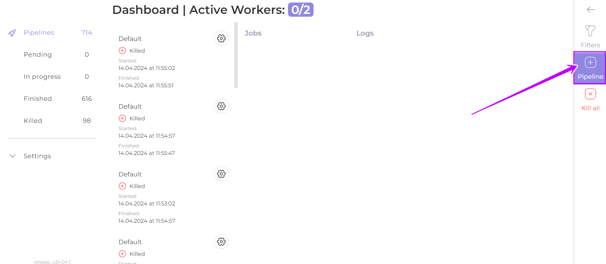
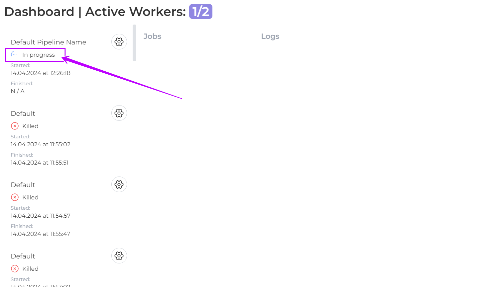
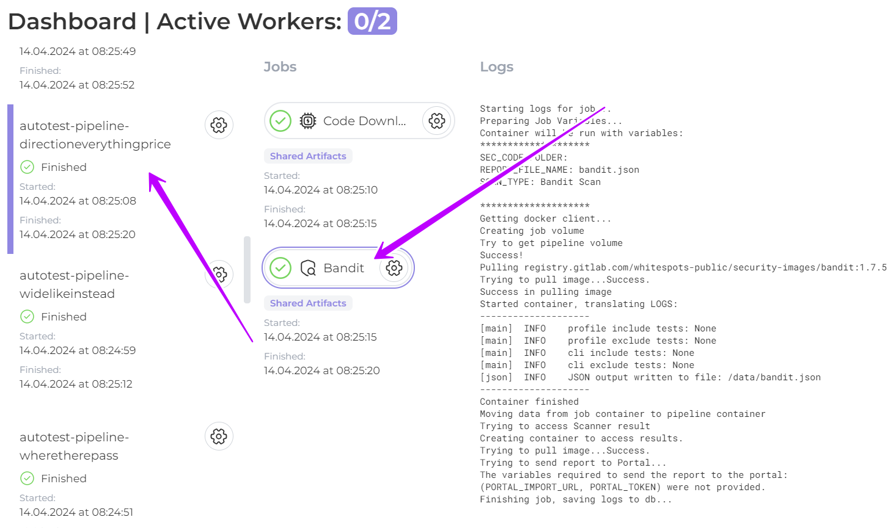
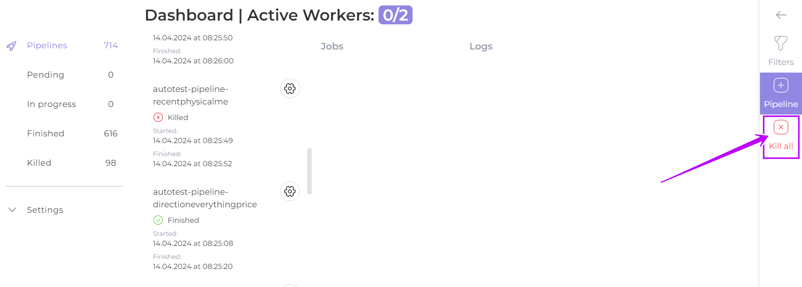

# Direct use of Auditor

If you are using Auditor **without** the Appsec Portal, **directly**:&#x20;

1. **Preconfigure Auditor**

if you are using your own images for job (scanners), [**preconfigure**](../settings/direct-use-of-the-auditor/docker-credentials.md) Auditor&#x20;

2. **Create pipline**

On the dashboard page click on  button

<figure><figcaption></figcaption></figure>

3. **Add Jobs**

Click on the **Jobs** field and create a sequence of jobs (scanners) by selecting the required jobs from the drop-down list&#x20;

Scanning will be performed sequentially based on the selected set of jobs

<figure><figcaption></figcaption></figure>

4. **Add environment variables**

The variables **require** you to specify information about your product and its location&#x20;

| Name                                                 | Description                                                                                                                        |
| ---------------------------------------------------- | ---------------------------------------------------------------------------------------------------------------------------------- |
| <mark style="color:blue;">`PRODUCT_NAME`</mark>      | name of your product                                                                                                               |
| <mark style="color:blue;">`PORTAL_IMPORT_URL`</mark> | address where reports will be sent (delivery point)                                                                                |
| <mark style="color:blue;">`PORTAL_TOKEN`</mark>      | credentials for delvery point                                                                                                      |
| <mark style="color:blue;">`REPOSITORY`</mark>        | URL of the cloned repository to be scanned, where the **code** will be checked in                                                  |
| <mark style="color:blue;">`DOCKER_IMAGE`</mark>      | reference to a list of your docker **images**, e.g. _registry.gitlab.com/whitespots-public/appsec-portal/back/appsecportal:latest_ |
| <mark style="color:blue;">`DOMAIN`</mark>            | domain of your **web** product                                                                                                     |
| <mark style="color:blue;">`HOST`</mark>              | IP address of your **web** product                                                                                                 |

Optionally you can specify other variables that you need to set

<figure><figcaption></figcaption></figure>

5. **Run pipline**

Click Run pipeline

The scanning of your product will commence.\
After all the jobs in your pipeline have finished their work, the status of the Pipeline will change from     **`In progress`** to **`Finished`**

<figure><figcaption></figcaption></figure>

6. **Get Results**

At the location specified by the environment variable (PORTAL\_URL), retrieve reports from each scanner in your pipeline

Clicking on a pipeline provides information about the Jobs in it, as well as Logs for each of them

<figure><figcaption></figcaption></figure>

You can bulk delete all pipelines by clicking on the button 

<figure><figcaption></figcaption></figure>


When scanning a code with Auditor, if the code is not loaded by the technical scanner, the pipelines are automatically killed.


You can also filter the available pipelines by clicking on the filter button in the right panel. \
You can filter your results by Job name and/or status

<figure><figcaption></figcaption></figure>
