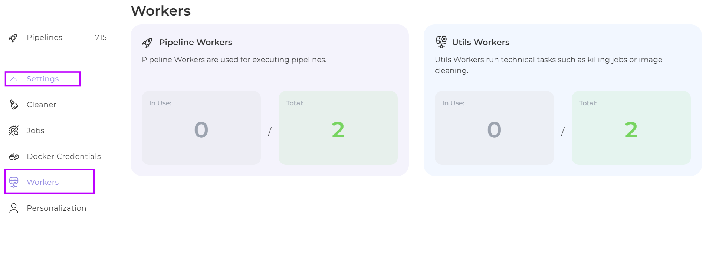

# Workers

On this page you can see how many workers are currently processing containers and how many are performing technical tasks (killing jobs or image cleaning).

<figure><figcaption></figcaption></figure>
