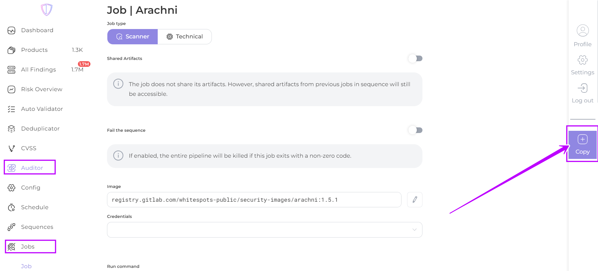

# Jobs

The Jobs page contains the [**configured**](job-configuration.md) jobs for processing your product

<table data-card-size="large" data-view="cards"><thead><tr><th align="center"></th><th align="center"></th><th></th><th data-hidden data-card-cover data-type="files"></th></tr></thead><tbody><tr><td align="center"></td><td align="center">Auditor interface</td><td></td><td></td></tr><tr><td align="center"></td><td align="center">AppSec Portal interface</td><td></td><td></td></tr></tbody></table>

There are two types of jobs:&#x20;

* [**Technical** jobs](technical-jobs.md): prepare the product for scanning
* [**Scanner** jobs](scanner-jobs.md): scan the product themselves

By selecting a specific job and clicking **Copy** in the right pane, you can copy the job and make changes to its configuration.

<figure><figcaption>
AppSec Portal interface
</figcaption></figure>

<figure><figcaption>
Auditor interface
</figcaption></figure>
